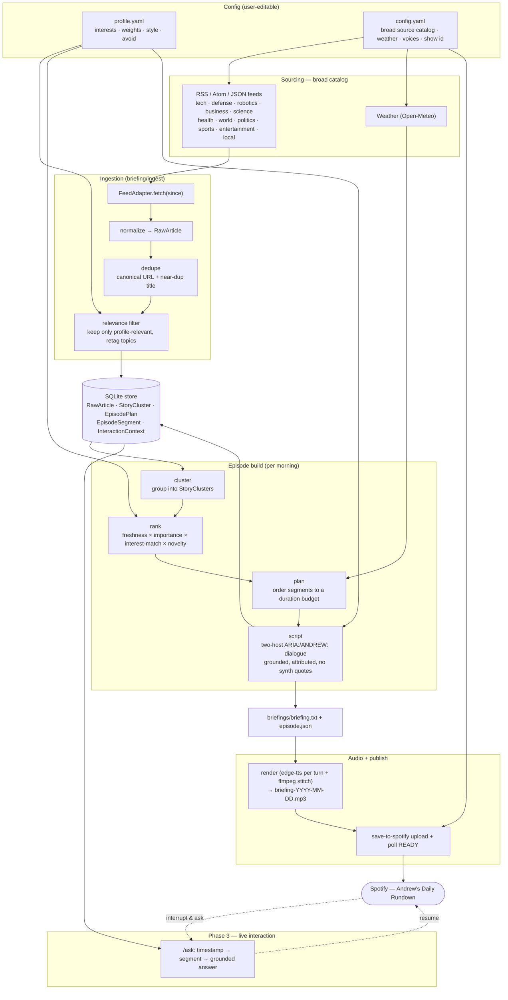

# Architecture

End-to-end flow from source feeds to a published Spotify episode (and the Phase 3
interaction layer that reads the same store). Two user-editable config files —
`profile.yaml` (interests + style) and `config.yaml` (feeds + operational settings) —
drive every personalized stage.

## Stage map (status + module)

| Stage | Module | Phase | Status |
|-------|--------|-------|--------|
| Config load + merge | `briefing/config.py` | 1 | ✅ built |
| Data models + store | `briefing/store/` | 1 | ✅ built |
| Sourcing catalog | `config.example.yaml` | 1 | ✅ broad catalog |
| Ingestion (fetch→normalize→dedupe→relevance) | `briefing/ingest/` | 1 | ✅ built |
| `brief ingest` CLI | `briefing/cli.py` | 1 | ✅ built |
| Weather adapter | `briefing/ingest/weather.py` | 1 | ⏳ next |
| Clustering | `briefing/cluster/` | 1 | ⏳ |
| Ranking (profile weights) | `briefing/rank/` | 1 | ⏳ |
| Planner (duration budget) | `briefing/plan/` | 1–2 | ⏳ |
| Scripting (grounded two-host) | `briefing/script/` | 1 | ⏳ |
| Render | `briefing/render/` | v0 | ✅ built |
| Upload | `make_briefing.sh` / `briefing/publish/` | v0 | ✅ built |
| Timecodes + segment model | `briefing/render/` | 2 | ⏳ |
| Retrieval prep + `/ask` | `briefing/store/`, API | 3 | ⏳ |

## Key design points

- **Broad sourcing, narrow keep.** The catalog spans all topics for robustness/open-source;
  the **relevance filter** keeps only what matches the active profile (topic intersection or
  interest keyword), drops the `avoid` list, and retags each kept article with profile topics.
- **Precompute offline, interact live.** Everything left of Spotify runs unattended each
  morning; only `/ask` (Phase 3) is live, grounded in that episode's stored sources.
- **Trust guardrails** enter at scripting: every claim traces to a source, no synthesized
  quotes, fact vs analysis separated, attribution recorded per `EpisodeSegment`.
