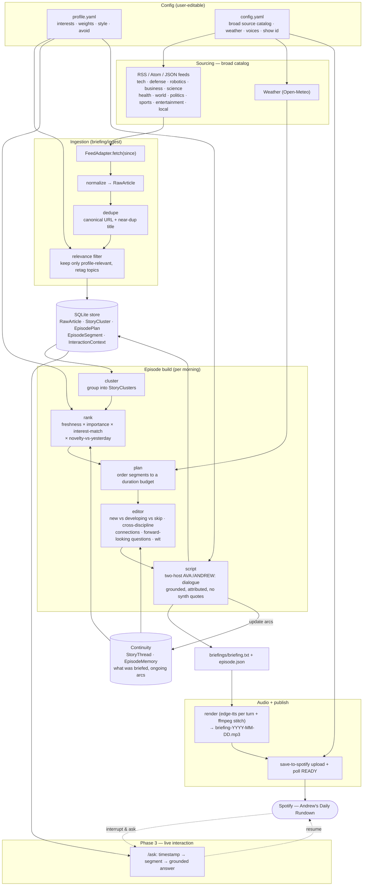

# Architecture

End-to-end flow from source feeds to a published Spotify episode (and the Phase 3
interaction layer that reads the same store). Two user-editable config files —
`profile.yaml` (interests + style) and `config.yaml` (feeds + operational settings) —
drive every personalized stage.

## Stage map (status + module)

| Stage | Module | Phase | Status |
|-------|--------|-------|--------|
| Config load + merge | `briefing/config.py` | 1 | ✅ built |
| Data models + store | `briefing/store/` | 1 | ✅ built |
| Sourcing catalog | `config.example.yaml` | 1 | ✅ broad catalog |
| Ingestion (fetch→normalize→dedupe→relevance) | `briefing/ingest/` | 1 | ✅ built |
| `brief ingest` CLI | `briefing/cli.py` | 1 | ✅ built |
| Weather adapter (Open-Meteo) | `briefing/ingest/weather.py` | 1 | ✅ built |
| Full-text extraction | `briefing/ingest/extract.py` | 1 | ✅ built |
| Clustering | `briefing/cluster/` | 1 | ✅ built |
| Ranking (profile weights + novelty) | `briefing/rank/` | 1 | ✅ built |
| Continuity (story threads / episode memory) | `briefing/continuity/` | 1 | ✅ built |
| Planner (duration budget from config) | `briefing/plan/` | 1–2 | ✅ built |
| Editor (connections · questions · wit) | `briefing/editor/` | 1 | ✅ built (Opus) |
| Scripting (grounded two-host) | `briefing/script/` | 1 | ✅ built (Sonnet) |
| LLM wrapper | `briefing/llm.py` | 1 | ✅ built |
| `brief generate` (full pipeline) | `briefing/cli.py` | 1 | ✅ built |
| Render | `briefing/render/` | v0 | ✅ built |
| Upload | `make_briefing.sh` / `briefing/publish/` | v0 | ✅ built |
| Timecodes + segment model | `briefing/render/` | 2 | ⏳ |
| Retrieval prep + `/ask` | `briefing/store/`, API | 3 | ⏳ |

## Key design points

- **Broad sourcing, narrow keep.** The catalog spans all topics for robustness/open-source;
  the **relevance filter** keeps only what matches the active profile (topic intersection or
  interest keyword), drops the `avoid` list, and retags each kept article with profile topics.
- **Precompute offline, interact live.** Everything left of Spotify runs unattended each
  morning; only `/ask` (Phase 3) is live, grounded in that episode's stored sources.
- **Trust guardrails** enter at scripting: every claim traces to a source, no synthesized
  quotes, fact vs analysis separated, attribution recorded per `EpisodeSegment`.

## Continuity — don't repeat yesterday, build on it

A briefing that re-reads the same headlines every day is noise. The pipeline keeps a
cross-episode memory so each episode knows what the listener already heard:

- **StoryThread** — a recurring story tracked across days (`id`, `title`, `topic`,
  `first_briefed`, `last_briefed`, `article_ids` over time, `summary_so_far`, `status:
  new | developing | dormant`). New clusters are matched to existing threads (entity/title
  overlap, later embeddings).
- **Ranking** uses **novelty-vs-yesterday**: a thread already briefed yesterday with no new
  developments is down-weighted or dropped; a thread with genuinely new facts is surfaced as
  *developing*.
- **The editor** decides per thread: **new** (introduce fully), **developing** (one-line
  recap → focus on what changed → "build on it"), or **skip** (nothing new worth the airtime).
- After publish, threads are updated with today's coverage so tomorrow can build on it.

## Editorial voice — what makes it worth listening to

The **editor** stage sits between planning and scripting. It turns a ranked, deduped,
continuity-aware rundown into an *editorial brief* per segment that the scripter renders as
dialogue. It is where the product stops being a feed reader and becomes a show. Its moves,
inspired by Marketplace's accessible-context style (Kai Ryssdal's "context beyond the
numbers"):

- **Connect across disciplines.** Find the thread linking otherwise-separate stories — a chip
  export rule touches *technology + defense + markets + robotics* — and say it out loud.
- **Plain-terms "why it matters."** Explain significance without jargon; assume a smart
  listener, not a specialist.
- **Forward-looking questions.** Pose the intelligent "so where is this headed?" question a
  curious analyst would ask — flagged as open questions, never answered with fabricated facts.
- **Wit, used sparingly.** A dry, earned joke or aside (Morning Brew brevity) — never forced,
  never at the expense of clarity.
- **Signature devices.** A quick markets wrap in the spirit of Marketplace's "let's do the
  numbers"; continuity callbacks ("yesterday we flagged X — today it moved"); a closing
  make-me-smart insight.
- **Guardrails hold.** Connections and questions are framed as analysis, kept distinct from
  sourced fact; the editor never invents quotes or data.

The two hosts carry this: **AVA** anchors (leads, frames, reads the through-line), **ANDREW**
is the analyst (connects, questions, the occasional aside). Tone and inspirations are
user-configurable in `profile.yaml` (`style.tone`, `style.inspirations`).
